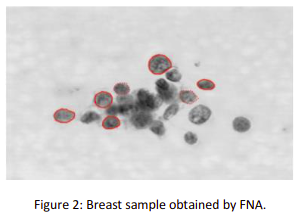

# KMeans

Accuracy of algorithm : 85%

## Task

---

In this task, you will use K-means clustering to try to diagnose breast cancer based solely on a Fine Needle Aspiration (FNA), which as the name suggests, takes a very small tissue sample using a syringe(Figure 1).

<div align="center">

</div>

To this end we will use the Wisconsin Diagnostic Breast Cancer dataset, containing information about 569 FNA breast samples. Each FNA produces an image as in Figure 2. Then a clinician isolates individual cells in each image, to obtain 30 characteristics (features), like size, shape, and texture. You will use these 30 features to cluster benign from malign FNA samples.

<div align="center">

</div>

## How To Install?

---

1. Fork repository and clone it
   ```
   git clone https://github.com/ibrahimdenizz/CEN348-homework.git
   ```
2. Install npm packages
    ```
    cd CEN348-homework/Kmeans && npm install
    ```

## How It Work?

---

Run index.js

```
node index.js
```
